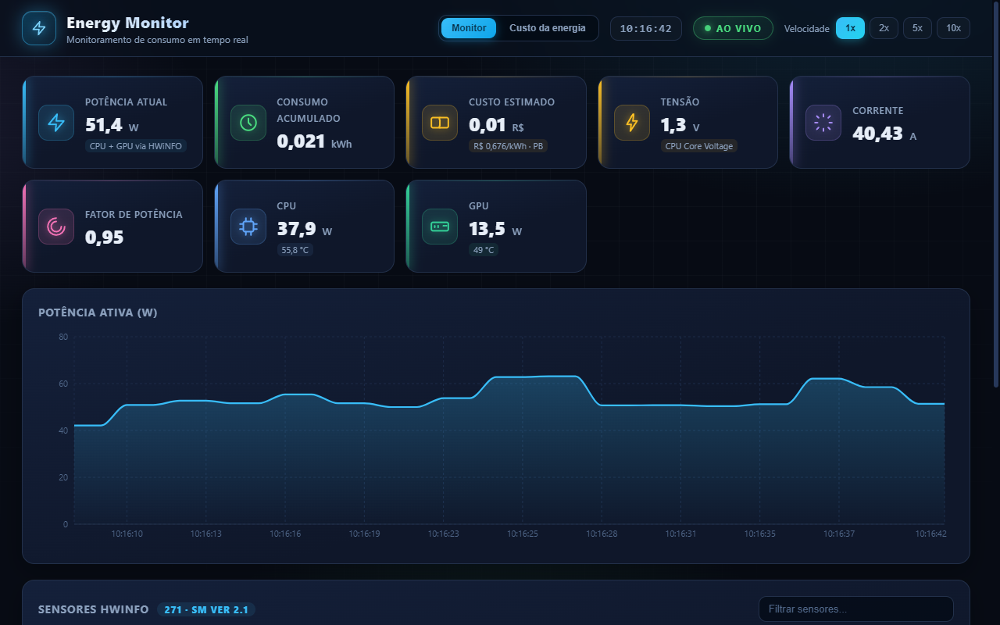
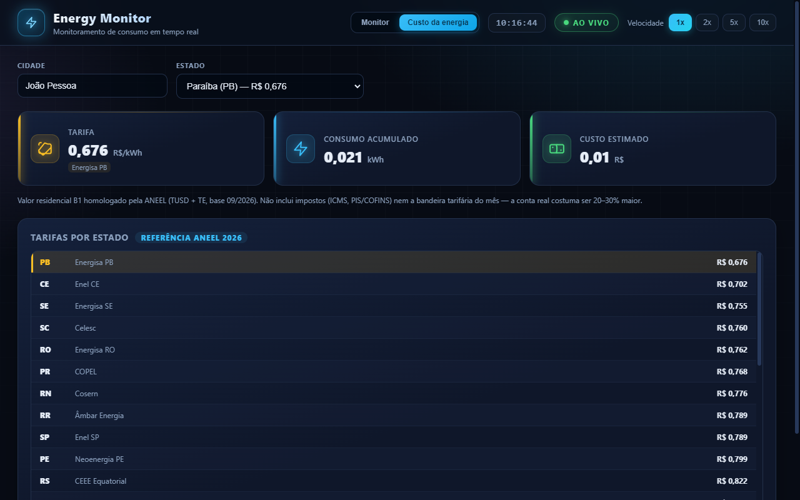

<div align="center">



# ⚡ Energy Monitor

**Monitoramento de consumo de energia elétrica em tempo real — CPU, GPU e tarifas — direto do HWiNFO64.**


[⤓ Baixar instalador](https://github.com/Viniciusgabrielcoelho/energy-monitor/releases/latest) ·
[Como usar](#-como-começar) ·
[Stack](#-stack) ·
[Estrutura](#-estrutura-do-projeto)

</div>

---

## Destaques

| | |
| :--- | :--- |
| **Dados reais de hardware** | Potência, tensão, corrente, fator de potência e temperaturas lidas do **HWiNFO64** via Shared Memory. |
| **Consumo que não se perde** | O kWh acumulado é salvo no disco a cada 10s — feche, reabra, reinicie: o contador continua de onde parou. |
| **Custo por estado** | Aba **Custo da energia** com tarifas residenciais (ANEEL, base 09/2026) dos 27 estados e calculadora automática do custo da sessão. |
| **Fica na bandeja** | Minimize ou feche a janela: o app continua rodando ao lado do relógio, medindo em segundo plano. |
| **Gráfico ao vivo** | Área com os últimos 300 pontos, atualizado a cada segundo. |
| **Painel de sensores** | Busca e filtro nos 270+ sensores do HWiNFO (potências, temperaturas, tensões…). |

---

## Interfaces

### Monitor em tempo real

O dashboard traz potência atual, tensão, corrente, fator de potência, consumo acumulado (persistente) e custo estimado com a tarifa do seu estado — tudo lido em tempo real do HWiNFO64.


### Custo da energia

Digite sua cidade (a UF é detectada automaticamente), escolha a distribuidora por estado e veja a tarifa aplicada ao consumo acumulado.



---

## Como começar

### 1. Instalar (recomendado)

Baixe o instalador na [página de releases](https://github.com/Viniciusgabrielcoelho/energy-monitor/releases/latest) e rode o `.exe`.

> Você também pode atualizar uma instalação existente na linha de comando:
> ```powershell
> "EnergyMonitor Setup 1.0.0.exe" --updated
> ```

### 2. Rodar a partir do código

```bash
npm install          # dependências
npm run dev          # UI no navegador (modo demonstração)
npm run dev:electron # app desktop completo
npm run build        # build de produção da UI
npm run dist         # gera o instalador em release/
```

### 3. Preparar o HWiNFO64

Dados reais vêm do **HWiNFO64** rodando em modo *Sensors-only*:

1. Abra o **HWiNFO64** no modo **"Sensors-only"**
2. Ative **Settings → Main → Shared Memory Support**
3. Abra o Energy Monitor — os dados aparecem automaticamente

> Sem o HWiNFO, o app continua abrindo normalmente e a aba de sensores fica vazia.

---

## Stack

| Camada | Tecnologia |
| :----- | :--------- |
| Shell | Electron 33 |
| UI | React 18 |
| Build | Vite 6 |
| Gráficos | Recharts 2 |
| Packager | electron-builder (NSIS) |
| Fonte de dados | HWiNFO64 Shared Memory |

---

## Estrutura do projeto

```
energy-monitor/
├── electron/                # processo principal do Electron
│   ├── main.js              # janela, bandeja e ciclo de vida
│   ├── energy.js            # acumulador persistente de kWh + IPC
│   ├── hwinfo.js            # leitor do Shared Memory do HWiNFO
│   ├── hwinfo-poll.ps1      # polling via PowerShell
│   └── preload.cjs          # ponte segura (contextIsolation)
├── src/                     # UI React
│   ├── App.jsx              # dashboard + abas
│   ├── tariffs.js           # tarifas ANEEL por estado
│   └── components/          # StatCard, EnergyChart, CostPanel
├── docs/                    # capturas de tela
└── scripts/                 # ferramentas de manutenção
```

---

<div align="center">

Feito com **Electron + React** · Licença **MIT**

</div>